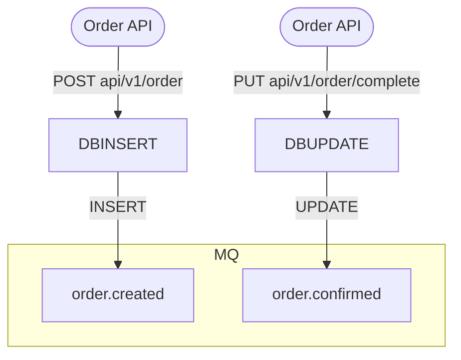
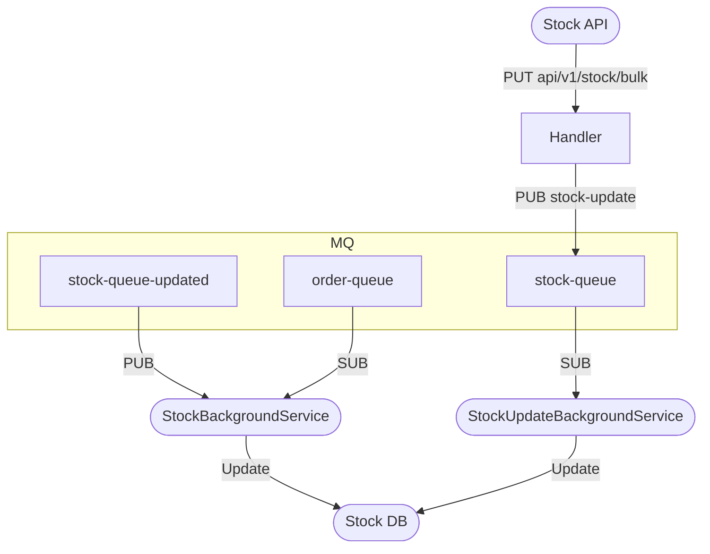
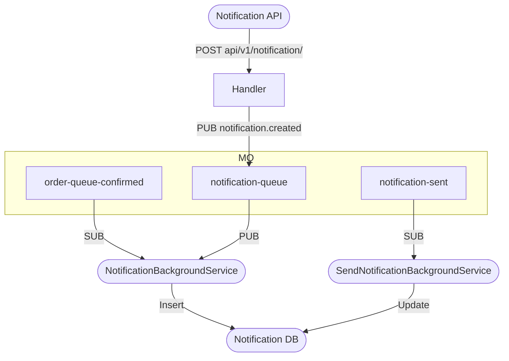

# Case Study

## Overview
This case study involves three APIs: Order API, Stock API, and Notification API. Each API has its own responsibilities and interacts with a message queue (MQ) to handle events and updates. The architecture diagrams illustrate the flow of data and interactions between the APIs and the message queue.

## Table of Contents
- [Overview](#overview)
- [Order API, Stock API, and Notification API](#order-api-stock-api-and-notification-api)
- [Architecture Diagrams](#architecture-diagrams)
  - [Order API Architecture Diagram](#order-api-architecture-diagram)
  - [Stock API Architecture Diagram](#stock-api-architecture-diagram)
  - [Notification API Architecture Diagram](#notification-api-architecture-diagram)

- [Pre-requisites](#pre-requisites)
- [Setup](#setup)
- [Tech Stack](#tech-stack)
- [Links](#links)


## Order API, Stock API, and Notification API
This case study involves three APIs: Order API, Stock API, and Notification API. Each API has its own responsibilities and interacts with a message queue (MQ) to handle events and updates.

### Order API
The Order API is responsible for managing orders. It has two main endpoints:
- `POST api/v1/order`: This endpoint is used to create a new order. When an order is created, it inserts the order into the database and publishes an event to the `order.created` queue.
- `PUT api/v1/order/complete`: This endpoint is used to mark an order as complete. When an order is completed, it updates the order in the database and publishes an event to the `order.confirmed` queue.
  - The Order API interacts with a database to store order information and uses a message queue to publish events related to order creation and completion.
  - The Order API is responsible for managing the lifecycle of orders, including creating new orders and marking them as complete.
  - The Order API is designed to be stateless, meaning that it does not maintain any session or state information between requests. Each request is independent and does not rely on any previous requests.

### Stock API
The Stock API is responsible for managing stock updates. It has one main endpoint:
- `PUT api/v1/stock/bulk`: This endpoint is used to update stock information in bulk. When stock information is updated, it publishes an event to the `stock-queue` and processes the updates using background services.
  - The Stock API interacts with a message queue to publish stock updates and uses background services to process these updates asynchronously.
  - The Stock API is responsible for managing stock levels and ensuring that the stock information is up-to-date.
  - The Stock API is designed to handle bulk updates efficiently, allowing multiple stock updates to be processed in a single request.

### Notification API
The Notification API is responsible for managing notifications. It has one main endpoint:
- `POST api/v1/notification/`: This endpoint is used to create a new notification. When a notification is created, it publishes an event to the `notification-queue` and processes the notification using background services.
  - The Notification API interacts with a message queue to publish notifications and uses background services to process these notifications asynchronously.
  - The Notification API is responsible for managing notifications and ensuring that they are sent to the appropriate recipients.
  - The Notification API is designed to handle notifications efficiently, allowing multiple notifications to be processed in parallel.

# Architecture Diagrams

# Order API Architecture Diagram



### Description
This diagram illustrates the architecture of the Order API system, where:
- `Order API` handles two endpoints: `POST api/v1/order` and `PUT api/v1/order/complete`.
- The `POST` request results in a `DB INSERT` operation followed by publishing to the `order.created` queue.
- The `PUT` request triggers a `DB UPDATE` operation followed by publishing to the `order.confirmed` queue.
- The message queue (`MQ`) contains two topics: `order.created` and `order.confirmed`.


# Stock API Architecture Diagram



### Description
This diagram illustrates the architecture of the Stock API system, where:
- `StockAPI` receives bulk stock updates via a PUT request to `api/v1/stock/bulk`.
- Updates are processed by a `Handler`, which publishes stock updates to a message queue (`MQ`).
- `MQ` consists of three queues: `order-queue`, `stock-queue-updated`, and `stock-queue`.
- Background services (`StockBackgroundService` and `StockUpdateBackgroundService`) subscribe to these queues to process updates and persist them in `Stock DB`.

# Notification API Architecture Diagram



### Description
This diagram illustrates the architecture of the Notification API system, where:
- `Notification API` handles a `POST` request at the endpoint `api/v1/notification/`.
- A `Handler` publishes notifications to the `notification-queue`.
- The message queue (`MQ`) consists of three queues: `order-queue-confirmed`, `notification-queue`, and `notification-sent`.
- Background services (`NotificationBackgroundService` and `SendNotificationBackgroundService`) process and update the data in the `Notification DB`.

## Pre-requisites
- Docker
- Docker Compose

## Setup
1. Clone Repository
2. Navigate to the project directory
3. Run the following command to start the services:
   ```bash
   docker-compose up -d
   ```
4. Access the APIs:
* Order API: [http://localhost:5066](http://localhost:5066)
* Stock API: [http://localhost:5067](http://localhost:5067)
* Notification API: [http://localhost:5065](http://localhost:5065)

## Tech Stack
- .NET 9
- RabbitMQ
- PostgreSQL
- Docker
- Docker Compose
- Polly
- Entity Framework Core
- MediatR

## Links
- [Architectural Diagram in Excalidraw](https://excalidraw.com/#json=utQB1Uq9p1LumsTH2Su1W,dlP0x6CAqPxW9eRdjFXP9g)

## Known Issues
- The `Stock API` is not fully implemented.
- The `Notification API` is not fully implemented.
- The `Order API` is not fully implemented.
- SendNotificationBackgroundService is not fully implemented. Not sending a real notification.
- There is no validation for the data being sent to the APIs.

